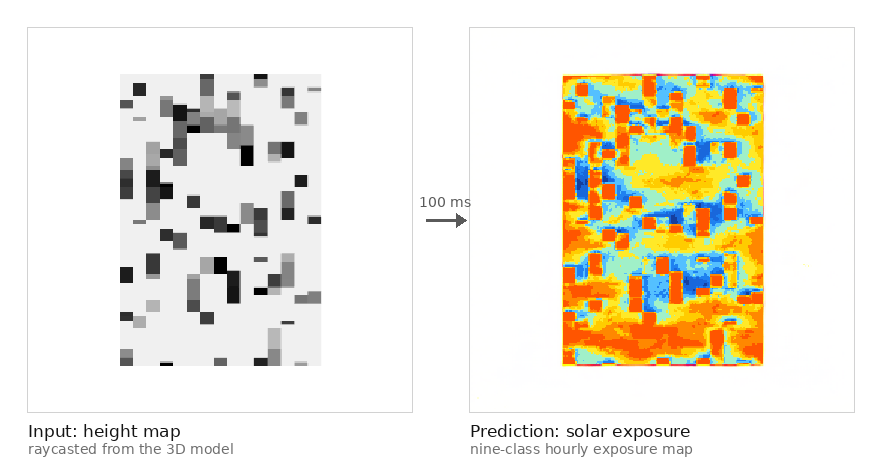

<h1 align="center">
  <br>
  ⚡ InstantSim
  <br>
</h1>

<h4 align="center">Real-time AI-Powered Solar Analysis for Architectural Design</h4>

<p align="center">
  
  
  
  
  
</p>

<p align="center">
  <a href="https://www.youtube.com/watch?v=3uCVHuaowtU&t=8s">📹 Live Demo</a> •
  <a href="docs/architecture.md">Architecture</a> •
  <a href="docs/development.md">Development</a> •
  <a href="docs/troubleshooting.md">Troubleshooting</a>
</p>

---

## Overview

Traditional building physics simulations (Ladybug/Honeybee, EnergyPlus, OpenFOAM) are accurate but prohibitively slow — a single annual daylight analysis can take **minutes to hours**, making iterative design exploration impractical.

**InstantSim** eliminates this bottleneck by replacing the simulation engine with a conditional deep learning model. A geometry change in Rhino triggers a full solar analysis in **under 100ms**, enabling true real-time feedback in the design loop.

> 🎬 **[Watch the full demo on YouTube →](https://www.youtube.com/watch?v=3uCVHuaowtU&t=8s)**

<p align="center">
  
</p>

### Key Capabilities

- **~100ms inference** from height map to color-coded solar heat map
- **Conditional generation** — sun vectors are injected into the model at inference time, allowing dynamic re-simulation without reloading the model
- **Live 3D visualization** — geometry and solar texture stream in real time from Rhino to a Three.js web dashboard via WebSocket
- **Perceptual color remapping** — frontend-configurable legend palette with Lab-space KNN matching
- **Statistical analysis** — per-frame computation of average sun hours, low-sun and high-solar-potential percentages, and hourly distribution

---

## Architecture

InstantSim follows a three-layer **Edge → Core → View** architecture:

```
┌──────────────────────────┐
│  Rhino / Grasshopper     │  ← Edge Layer
│  · Height map generation │    Geometry + raycasting
│  · Sun vector computation│    HTTP POST / WebSocket
└────────────┬─────────────┘
             │  POST /predict  (PNG, ~10KB)
             │  POST /sync_model  (geometry JSON)
             ▼
┌──────────────────────────┐
│  FastAPI Backend         │  ← Core Layer
│  · SolarGenerator (AI)   │    PyTorch inference
│  · WebSocket broadcast   │    OpenCV post-processing
│  · Async event loop      │    Debug image logging
└────────────┬─────────────┘
             │  WS broadcast  (binary blobs + JSON)
             ▼
┌──────────────────────────┐
│  Three.js Web Dashboard  │  ← View Layer
│  · 3D scene rendering    │    UV texture mapping
│  · Heat map overlay      │    ECharts statistics
│  · Design version panel  │    WebSocket client
└──────────────────────────┘
```

---

## Model Architecture: Conditional U-Net with FiLM

The core of InstantSim is a **custom conditional U-Net generator** that extends the standard pix2pix architecture with physics-aware sun vector conditioning. Rather than treating solar simulation as a naive image-to-image problem, the model receives the sun's 3D directional vectors as a structured conditioning signal — allowing it to generalize across different times of day, seasons, and latitudes without retraining.

### SolarGenerator

```
Input: height map (3×256×256) + sun vectors (36-dim)
Output: solar heat map (3×256×256)

Sun Vector Format:
  [v0, v1, v2, ..., v8]  →  9 hourly sun directions × (x, y, z)  =  27 floats
  [m0, m1, ..., m8]      →  9 binary hour masks (daytime flags)    =   9 floats
  Total: 36 floats

Architecture:
  SunConditionEncoder → per-vector MLP → fuse → embedding (128-dim)
       ↓
  8-level U-Net encoder (Conv2d + FiLM-InstanceNorm)
       ↓
  Bottleneck: embedding injected as spatial feature bias
       ↓
  8-level U-Net decoder (ConvTranspose2d + FiLM-InstanceNorm + skip connections)
       ↓
  Tanh output → color heat map
```

### FiLM Conditioning (Feature-wise Linear Modulation)

Each encoder and decoder block uses **FiLM** layers instead of standard BatchNorm. The sun embedding modulates every feature map in the network through learned affine parameters:

```python
# γ and β are predicted from the sun embedding at each layer
x_norm = InstanceNorm2d(x)
γ, β   = Linear(sun_emb) → split
output = γ * x_norm + β
```

This conditioning mechanism is applied at **all 14 encoder/decoder blocks**, allowing the sun geometry to directly influence spatial feature distributions at every scale of the network — a key advantage over late-fusion approaches that only condition at the bottleneck.

### Training Setup

| Parameter | Value |
|-----------|-------|
| Dataset | 6,000+ synthetic Ladybug-generated pairs |
| Input | Raycasted height maps (grayscale → RGB replicated) |
| Label | Annual radiation maps (9-hour color-coded) |
| Augmentation | Random rotation, horizontal/vertical flip, brightness jitter |
| Loss | L1 + adversarial (pix2pix) |
| Optimizer | Adam (β₁=0.5, β₂=0.999) |
| Input resolution | 256×256 (upscaled to 512×512 for output) |
| Output resolution | 512×512 (INTER_NEAREST — preserves hard boundaries) |

---

## Tech Stack

| Layer | Technology | Role |
|-------|-----------|------|
| **AI Framework** | PyTorch 2.0+ | Model definition, training, inference |
| **Model** | Custom U-Net + FiLM | Conditional image-to-image translation |
| **Training Data** | Ladybug Tools | Ground-truth annual solar simulation |
| **Backend** | FastAPI + Uvicorn | Async REST + WebSocket server |
| **Image Processing** | OpenCV, NumPy | Pre/post-processing, color remapping |
| **Color Science** | CIE Lab color space | Perceptual KNN color matching |
| **Geometry Input** | Rhino / Grasshopper | 3D model + raycasted height maps |
| **Frontend** | Three.js | 3D scene, UV texture mapping |
| **Charts** | ECharts | Real-time solar statistics dashboard |
| **Communication** | WebSocket | Bidirectional binary + JSON streaming |

---

## Project Structure

```
InstantSim/
├── backend/
│   ├── app/
│   │   ├── main.py                  # FastAPI app, WebSocket manager, lifecycle
│   │   ├── core/
│   │   │   └── inference.py         # SolarPredictor: preprocessing, inference,
│   │   │                            #   post-processing, color remapping, stats
│   │   └── models/
│   │       ├── networks.py          # SolarGenerator, SunConditionEncoder, FiLM
│   │       └── city_sun_model.pth   # trained weights (not in the repo, see below)
│   ├── frontend/
│   │   └── index.html               # Three.js dashboard (single-file SPA)
│   └── requirements.txt
├── training/
│   ├── README.md                    # data layout and how to run training
│   ├── train_custom_solar.py        # model, dataset and training loop
│   └── validate_model.py            # inference validation utilities
├── gh_scripts/
│   ├── data-generator.gh            # Grasshopper data generation definition
│   └── model.3dm                    # sample Rhino scene
├── scripts/
│   └── rename_dataset.py            # dataset file renaming helper
├── docs/
│   ├── architecture.md              # full system design document
│   ├── development.md               # dev environment and training guide
│   └── troubleshooting.md           # common issues and fixes
└── README.md
```

---

## Quick Start

### Prerequisites

- Python 3.9+
- Rhino 7+ with Grasshopper (for live geometry input)

### 1. Clone the repository

```bash
git clone https://github.com/JingzheZhao/InstantSim.git
cd InstantSim
```

### 2. Set up the backend

```bash
cd backend
pip install -r requirements.txt
```

### 3. Place the model weights

The trained weights (229 MB) are not tracked in this repository. Download
[city_sun_model.pth](https://github.com/JingzheZhao/InstantSim/releases/download/V1.0.0/city_sun_model.pth)
from the [v1.0.0 release](https://github.com/JingzheZhao/InstantSim/releases/tag/V1.0.0)
and place it at:

```
backend/app/models/city_sun_model.pth
```

### 4. Run the server

```bash
uvicorn app.main:app --reload --host 0.0.0.0 --port 8000
```

Navigate to `http://localhost:8000`. The Three.js dashboard is served directly
from the backend.

---

## API Reference

### WebSocket `/ws`

Real-time bidirectional channel between the web dashboard and the backend.

**Frontend → Backend (Text)**

```json
// Send color legend (required before any inference)
{ "type": "LEGEND_PALETTE", "format": "hex", "colors": ["#3d5a9e", ..., "#ff5500"] }

// Send sun vectors (triggers re-inference on cached image)
{ "type": "UPDATE_SIMULATION", "sun_vectors": [x0, y0, z0, ..., m0, ..., m8] }
```

**Backend → Frontend (Text + Binary)**

```
"UPDATE_TEXTURE"           → new analysis incoming
"BLOB_TYPE:ANALYSIS"       → next binary frame is the solar heat map
<binary PNG>               → 512×512 color-mapped heat map
"BLOB_TYPE:MASK"           → next binary frame is the geometry mask
<binary PNG>               → 512×512 valid-pixel mask
{ "type": "ANALYSIS_RESULT", "data": { "avg": 5.2, "low_sun": 8.1, ... } }
```

### HTTP Endpoints

**`POST /predict`** — Triggered by Grasshopper on geometry change

```bash
curl -X POST http://localhost:8000/predict \
  -F "file=@height_map.png"
# Returns: 512×512 PNG (solar heat map)
```

**`POST /sync_model`** — Stream 3D geometry to all connected dashboards

```json
{
  "vertices": [x1, y1, z1, x2, y2, z2, ...],
  "faces":    [i0, i1, i2, i3, i4, i5, ...]
}
```

---

## Inference Pipeline

Each prediction follows this exact pipeline:

```
1. Receive PNG from Grasshopper (height map, 512×512)
        │
2. Resize to 256×256 (INTER_NEAREST — preserve discrete building edges)
        │
3. ToTensor + Normalize to [-1, 1]
        │
4. Forward pass: SolarGenerator(image_tensor, sun_vectors)
        │
5. Denormalize output → RGB uint8
        │
6. Build valid-pixel mask (exclude background=255)
   Apply 1px erosion (remove anti-aliased edge pixels from stats)
        │
7. Color remapping (Lab KNN):
   original_palette → classify each pixel → remap to frontend palette
   Apply 1.4× saturation boost in HSV space
        │
8. Compute statistics (mean sun hours, % low-sun, % high-solar-potential,
   9-bin hourly distribution) using Lab KNN classification
        │
9. Upscale to 512×512 (INTER_NEAREST)
        │
10. WebSocket broadcast: UPDATE_TEXTURE → ANALYSIS blob → MASK blob → JSON stats
```

---

## Post-processing & Artifact Removal

The model produces edge cases that require deterministic post-processing:

| Artifact | Root Cause | Fix |
|----------|-----------|-----|
| Red dot matrix | Dropout active at test time + BatchNorm instability | 3×3 median blur |
| Blue border fringe | Convolution zero-padding at image edges | Crop outer 2px → resize back |
| Low-building misclassification | Input contrast too low for shallow structures | Adjust height map normalization range |
| Texture UV misalignment | Coordinate origin mismatch (Rhino Z-up vs Three.js Y-up) | Bounding-box planar projection + negative V flip |

---

## Color System & Statistics

InstantSim uses a perceptually-uniform gradient from deep blue (low exposure) to orange-red (high exposure), fully configurable from the frontend:

```
0h  → #3d5a9e  Deep Blue       (shadow zones)
1h  → #5b9ff0  Bright Blue
2h  → #90d8ff  Sky Blue
3h  → #c8efff  Pale Blue
4h  → #e8f8d0  Light Green
5h  → #fff066  Yellow
6h  → #ffd000  Amber
7h  → #ffaa00  Orange          (PV-viable threshold)
8h  → #ff7700  Deep Orange
9h  → #ff5500  Orange-Red      (high solar potential)
```

All statistics are computed in **CIE Lab color space** using nearest-neighbor classification, providing perceptual accuracy that RGB-based matching cannot achieve. Reported metrics per frame:

- **Average Sun Hours** — area-weighted mean across valid building surfaces
- **Low Sun % (<2h)** — fraction of underlit surfaces (shading concern)
- **Solar Potential % (>6h)** — fraction suitable for photovoltaic installation
- **Hourly Distribution** — 9-bin histogram for full exposure profile

---

## MLOps Pipeline

```
DATA COLLECTION
  └─ Grasshopper automation → 6,000+ height map + radiation map pairs
  └─ Preprocessing: resize, normalize, augment (rotation/flip/brightness)

TRAINING  (training/)
  └─ Custom pix2pix loop with sun vector conditioning
  └─ 80/20 train/validation split
  └─ Checkpoint saved every 10 epochs → best validation checkpoint selected
  └─ Final export: city_sun_model.pth

DEPLOYMENT
  └─ Uvicorn serving the FastAPI app and the single-file dashboard
  └─ Model weights loaded once at startup
  └─ CORS-open for local Grasshopper → backend → browser pipeline

MONITORING
  └─ Per-inference Solar Debug Reports logged to stdout
  └─ Debug images saved to debug_outputs/ (input, raw output, remapped, mask)
```

---

## Roadmap

### Completed
- [x] Grasshopper automated data generation pipeline
- [x] Custom FiLM-conditioned U-Net training
- [x] FastAPI backend with async WebSocket broadcast
- [x] Lab-space color remapping system
- [x] Three.js 3D heat map with UV texture streaming
- [x] Real-time re-simulation on sun vector update

### In Progress / Planned
- [ ] GPU inference (target: <10ms per frame)
- [ ] Multi-climate model support (different latitude presets)
- [ ] Design version control (Git-like snapshot & diff viewer)
- [ ] Wind/CFD analysis module (second pix2pix head)
- [ ] PDF report export
- [ ] Revit API integration (BIM workflow)

---

## Development

See [docs/development.md](docs/development.md) for:
- Setting up the training environment
- Running the data generation pipeline in Grasshopper
- Training a custom model from scratch
- Validation and debugging utilities

See [docs/architecture.md](docs/architecture.md) for:
- Full component-level system design
- Coordinate system transformation matrices (Rhino Z-up ↔ Three.js Y-up)
- UV mapping strategy and texture flip correction
- Scalability and horizontal scaling notes

---

## Contributing

Contributions, issues, and feature requests are welcome. Please open an issue first to discuss what you'd like to change.

---

## Training

The training script in `training/` is self-contained PyTorch: it defines the
model, the dataset and the training loop. See
[training/README.md](training/README.md) for the data layout and how to run it.

---

## License and third-party code

This project is released under the MIT License (see [LICENSE](LICENSE)).

The conditional generator follows the pix2pix formulation of Isola et al.
(2017); the reference implementation by Jun-Yan Zhu and Taesung Park is
distributed under its own BSD license and is not included in this repository.

---

## Acknowledgments

- Conditional image generation based on [pix2pix](https://phillipi.github.io/pix2pix/) (Isola et al., 2017)
- FiLM conditioning inspired by [FiLM: Visual Reasoning with a General Conditioning Layer](https://arxiv.org/abs/1709.07871)
- Ground-truth solar data generated with [Ladybug Tools](https://www.ladybug.tools/)
- 3D visualization powered by [Three.js](https://threejs.org/)
- Backend framework: [FastAPI](https://fastapi.tiangolo.com/)

---

## Contact

For questions or collaboration, open an issue or reach out at [jingzhezhao1303@gmail.com](mailto:jingzhezhao1303@gmail.com).

---

<p align="center"><i>Built by an architect, for architects — because great design deserves real-time feedback.</i></p>
